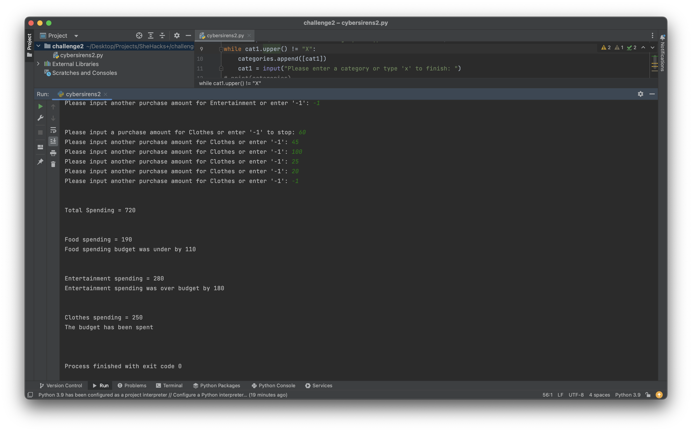

# BudgetingProgram
This is a budgeting calculator program made using Python. The program works by prompting the user to enter their spending categories and allows them to set a budget for each one. The program then prompts the user to enter purchases for each category. After calculating the total spending, it returns whether the user was over, under, or at the budget for each category. This app was created by Team CyberSirens for SheHacks+7.

# Demo

# Technical Stack
Python
